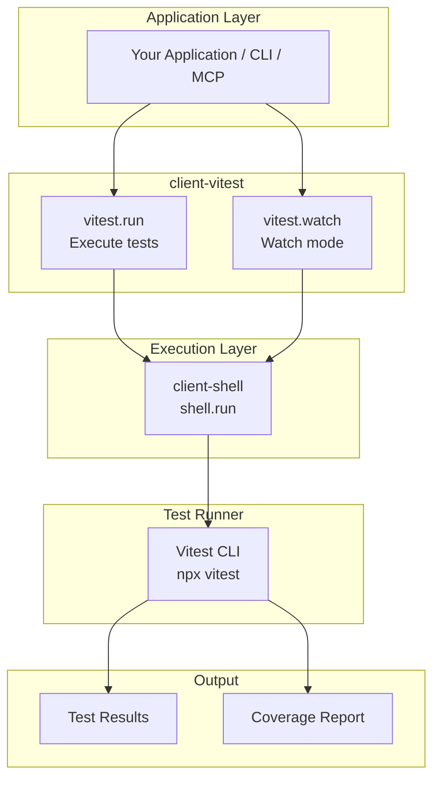
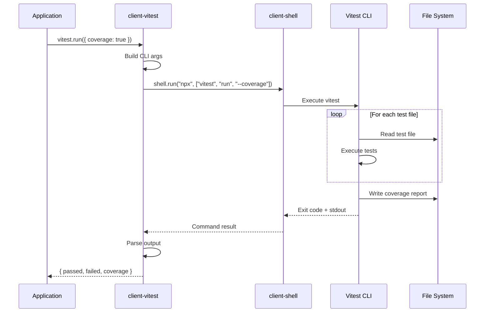
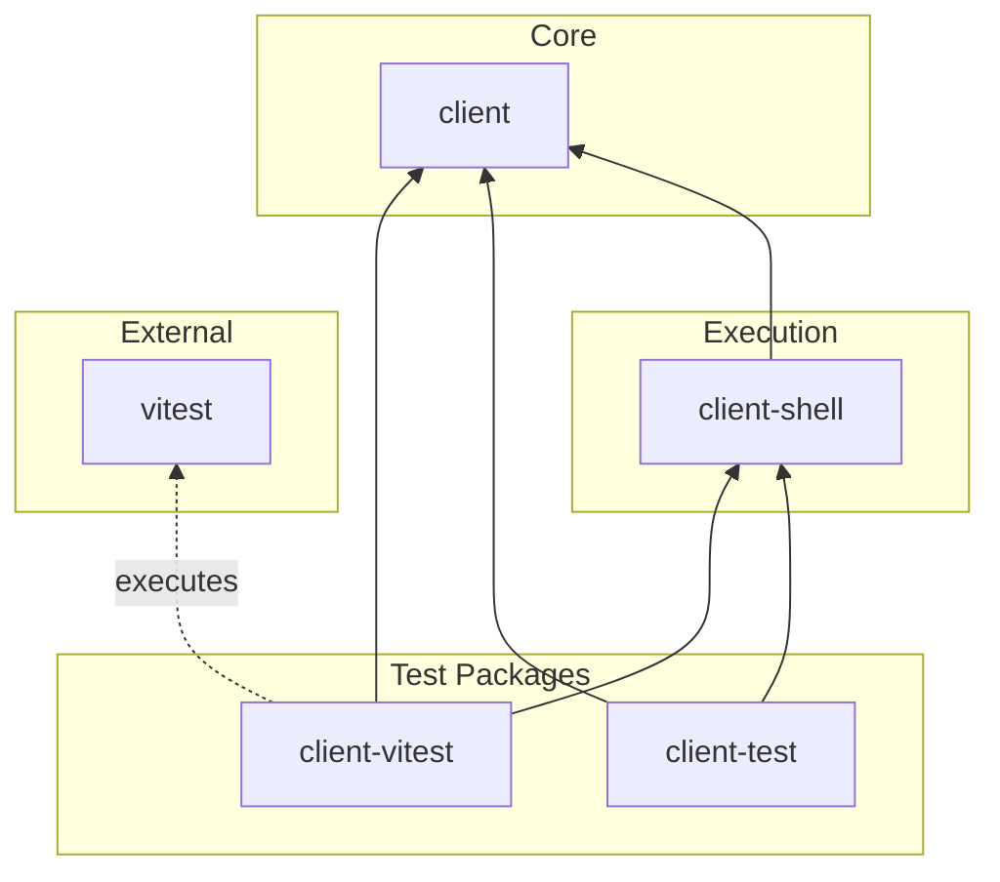
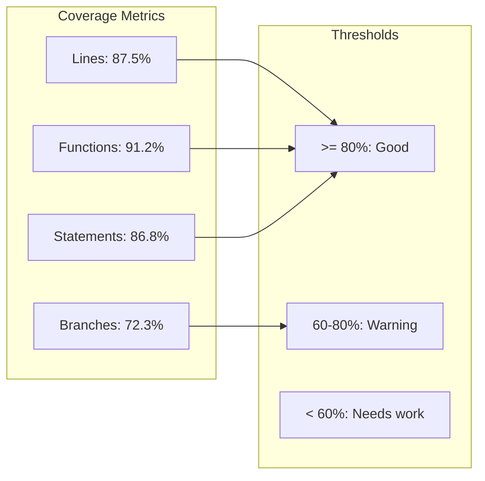
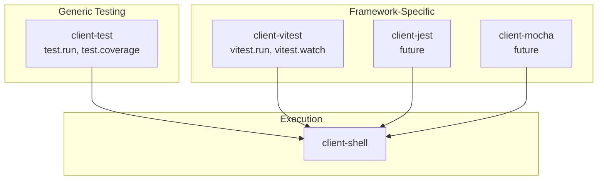

# @mark1russell7/client-vitest

[](https://opensource.org/licenses/MIT)
[](https://www.typescriptlang.org/)
[](https://nodejs.org/)
[](https://vitest.dev/)

> Vitest-specific test procedures. Run and watch tests with full coverage reporting.

## Table of Contents

- [Overview](#overview)
- [Installation](#installation)
- [Architecture](#architecture)
- [Quick Start](#quick-start)
- [API Reference](#api-reference)
  - [vitest.run](#vitestrun)
  - [vitest.watch](#vitestwatch)
- [Coverage Reporting](#coverage-reporting)
- [CLI Usage](#cli-usage)
- [Integration](#integration)
- [Requirements](#requirements)
- [License](#license)

---

## Overview

**client-vitest** provides procedures for running Vitest tests:

- **Test Execution** - Run tests once with configurable patterns
- **Watch Mode** - Continuous testing during development
- **Coverage Reports** - Line, branch, function, and statement coverage
- **Multiple Reporters** - Default, verbose, JSON, and JUnit output

---

## Installation

```bash
npm install github:mark1russell7/client-vitest#main
```

---

## Architecture

### System Overview



### Test Execution Flow



### Package Dependencies



---

## Quick Start

```typescript
import { Client } from "@mark1russell7/client";
import "@mark1russell7/client-vitest/register";

const client = new Client({ /* transport */ });

// Run all tests
const result = await client.call(["vitest", "run"], {
  cwd: "/path/to/project",
});

console.log(`Passed: ${result.passed}, Failed: ${result.failed}`);

// Run with coverage
const coverage = await client.call(["vitest", "run"], {
  coverage: true,
});

if (coverage.coverage) {
  console.log(`Line coverage: ${coverage.coverage.lines}%`);
}
```

---

## API Reference

### Procedures Summary

| Path | Description |
|------|-------------|
| `vitest.run` | Run tests once |
| `vitest.watch` | Start watch mode |

---

### vitest.run

Run Vitest tests with configurable options.

```typescript
interface VitestRunInput {
  cwd?: string;          // Working directory
  include?: string[];    // Include patterns
  exclude?: string[];    // Exclude patterns
  watch?: boolean;       // Watch mode
  coverage?: boolean;    // Enable coverage
  reporter?: "default" | "verbose" | "json" | "junit";
  passWithNoTests?: boolean;  // Pass if no tests found
}

interface VitestRunOutput {
  success: boolean;
  passed: number;
  failed: number;
  skipped: number;
  duration: number;      // ms
  coverage?: {
    lines: number;
    branches: number;
    functions: number;
    statements: number;
  };
}
```

**Options:**

| Option | Type | Default | Description |
|--------|------|---------|-------------|
| `cwd` | string | "." | Working directory |
| `include` | string[] | - | Glob patterns to include |
| `exclude` | string[] | - | Glob patterns to exclude |
| `coverage` | boolean | false | Enable coverage reporting |
| `reporter` | string | "default" | Output format |
| `passWithNoTests` | boolean | false | Don't fail if no tests |

**Example:**
```typescript
// Run specific tests
const result = await client.call(["vitest", "run"], {
  include: ["src/**/*.test.ts"],
  exclude: ["**/*.e2e.test.ts"],
  reporter: "verbose",
});

// Run with coverage threshold check
const coverage = await client.call(["vitest", "run"], {
  coverage: true,
});

if (coverage.coverage && coverage.coverage.lines < 80) {
  console.warn("Coverage below 80%!");
  process.exit(1);
}
```

---

### vitest.watch

Start Vitest in watch mode for continuous testing.

```typescript
interface VitestWatchInput {
  cwd?: string;          // Working directory
  include?: string[];    // Include patterns
}

interface VitestWatchOutput {
  pid: number;           // Process ID
  status: "started" | "stopped";
}
```

**Example:**
```typescript
// Start watch mode
const { pid } = await client.call(["vitest", "watch"], {
  include: ["src/**/*.test.ts"],
});

console.log(`Vitest watching (PID: ${pid})`);

// Later: stop watch mode by killing PID
```

---

## Coverage Reporting

### Enabling Coverage

```typescript
const result = await client.call(["vitest", "run"], {
  coverage: true,
});
```

### Coverage Output Format

```typescript
{
  success: true,
  passed: 42,
  failed: 0,
  skipped: 2,
  duration: 5432,
  coverage: {
    lines: 87.5,      // Percentage of lines covered
    branches: 72.3,   // Percentage of branches covered
    functions: 91.2,  // Percentage of functions covered
    statements: 86.8  // Percentage of statements covered
  }
}
```

### Coverage Visualization



---

## CLI Usage

```bash
# Run tests via mark CLI
mark vitest run

# Run with coverage
mark vitest run --coverage

# Run specific patterns
mark vitest run --include "src/**/*.unit.test.ts"

# Multiple patterns
mark vitest run --include "src/**/*.test.ts" --exclude "**/*.e2e.test.ts"

# Start watch mode
mark vitest watch

# Verbose output
mark vitest run --reporter verbose
```

---

## Integration

### With MCP (Claude)

When using the MCP server, Claude can:
- Run tests: "Run the tests for this project"
- Check coverage: "Run tests with coverage and tell me the results"
- Watch mode: "Start test watch mode"

### With DAG Traverse

```typescript
// Run tests across all packages in dependency order
await client.call(["dag", "traverse"], {
  visit: ["vitest", "run"],
  concurrency: 2,
});
```

### With CI/CD

```typescript
// CI script example
const result = await client.call(["vitest", "run"], {
  coverage: true,
  reporter: "junit",
});

if (!result.success) {
  process.exit(1);
}

if (result.coverage && result.coverage.lines < 80) {
  console.error("Coverage threshold not met");
  process.exit(1);
}
```

### With Other Test Packages



---

## Requirements

- **Node.js** >= 20
- **Vitest** >= 3.0 (peer dependency)
- **Dependencies:**
  - `@mark1russell7/client`
  - `@mark1russell7/client-shell`

---

## License

MIT
