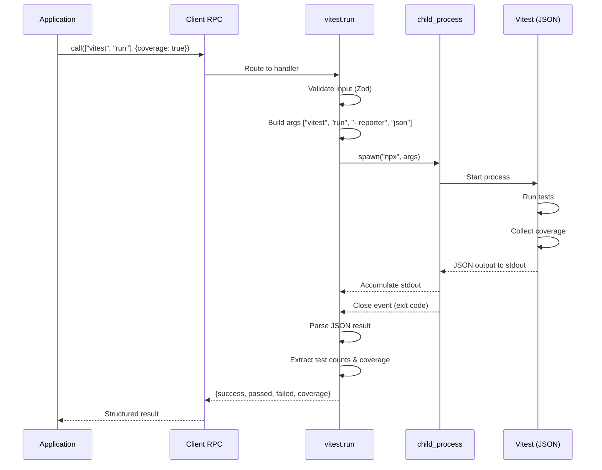
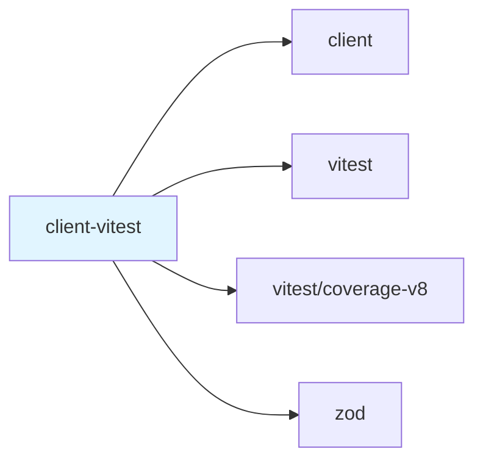

# @mark1russell7/client-vitest

[](https://www.npmjs.com/package/@mark1russell7/client-vitest)
[](https://opensource.org/licenses/MIT)

Vitest-specific test procedures with direct Node.js integration - run and watch tests with structured output.

## Overview

`client-vitest` provides client procedures that directly integrate with Vitest using Node.js `child_process`. Unlike `client-test` (which uses shell.exec), this package spawns Vitest processes directly and parses JSON output for structured test results including detailed coverage metrics.

### Key Features

- **Direct Vitest Integration**: Spawns vitest via `child_process.spawn`
- **Structured Output**: Parses JSON reporter for detailed test results
- **Coverage Metrics**: Returns line/branch/function/statement coverage percentages
- **Watch Mode**: Background process management with PID tracking
- **Pattern Support**: Include/exclude test file patterns
- **Reporter Options**: default, verbose, json, junit
- **Zero Shell Overhead**: No shell intermediary

## Installation

```bash
npm install @mark1russell7/client-vitest
```

### Dependencies

- `vitest` - Test runner
- `@vitest/coverage-v8` - Coverage provider
- `@mark1russell7/client` - Client RPC system
- `zod` - Schema validation

## Architecture

```mermaid
graph TB
    subgraph "Application Layer"
        App[Application Code]
        CLI[CLI Commands]
    end

    subgraph "client-vitest Package"
        Register[register.ts<br/>Auto-registration]
        VitestRun[vitest.run<br/>Procedure]
        VitestWatch[vitest.watch<br/>Procedure]
        Schemas[Zod Schemas<br/>Input Validation]
    end

    subgraph "Execution Layer"
        Spawn[child_process.spawn]
        Vitest[Vitest Process<br/>JSON Reporter]
    end

    App -->|call vitest.run| VitestRun
    CLI -->|call vitest.watch| VitestWatch

    Register -->|registers| VitestRun
    Register -->|registers| VitestWatch

    VitestRun -->|validates| Schemas
    VitestWatch -->|validates| Schemas

    VitestRun -->|spawn('npx vitest')| Spawn
    VitestWatch -->|spawn detached| Spawn

    Spawn -->|executes| Vitest
    Vitest -->|JSON stdout| VitestRun
    Vitest -->|PID| VitestWatch

    style Register fill:#e1f5ff
    style VitestRun fill:#e8f5e9
    style VitestWatch fill:#e8f5e9
    style Schemas fill:#fff4e1
```

### Execution Flow



## Usage

### Basic Test Execution

```typescript
import { Client } from "@mark1russell7/client";

const client = new Client();

// Run all tests
const result = await client.call(["vitest", "run"], {
  cwd: "/path/to/package"
});

console.log(`Passed: ${result.passed}`);
console.log(`Failed: ${result.failed}`);
console.log(`Skipped: ${result.skipped}`);
console.log(`Duration: ${result.duration}ms`);
```

### Coverage Collection

```typescript
// Run with coverage
const result = await client.call(["vitest", "run"], {
  cwd: "/path/to/package",
  coverage: true
});

if (result.coverage) {
  console.log(`Lines: ${result.coverage.lines}%`);
  console.log(`Branches: ${result.coverage.branches}%`);
  console.log(`Functions: ${result.coverage.functions}%`);
  console.log(`Statements: ${result.coverage.statements}%`);
}
```

### Pattern Matching

```typescript
// Run specific test files
await client.call(["vitest", "run"], {
  include: ["src/**/*.unit.test.ts", "src/**/*.spec.ts"],
  exclude: ["**/*.e2e.test.ts", "**/*.integration.test.ts"]
});
```

### Watch Mode

```typescript
// Start watch mode (detached process)
const watchResult = await client.call(["vitest", "watch"], {
  cwd: "/path/to/package",
  include: ["src/**/*.test.ts"]
});

console.log(`Vitest watching (PID: ${watchResult.pid})`);
console.log(`Status: ${watchResult.status}`); // "started"

// Process runs in background, unref'd from parent
```

### Reporter Selection

```typescript
// Use verbose reporter
await client.call(["vitest", "run"], {
  reporter: "verbose"
});

// Use JUnit for CI
await client.call(["vitest", "run"], {
  reporter: "junit"
});
```

## API Reference

### Procedures

#### `vitest.run`

Run Vitest tests once with structured output.

**Path:** `["vitest", "run"]`

**Input:**
```typescript
{
  cwd?: string;                                    // Working directory
  include?: string[];                              // Patterns to include
  exclude?: string[];                              // Patterns to exclude
  watch?: boolean;                                 // Enable watch mode
  coverage?: boolean;                              // Collect coverage
  reporter?: "default" | "verbose" | "json" | "junit";  // Reporter type
  passWithNoTests?: boolean;                       // Pass if no tests found
}
```

**Output:**
```typescript
{
  success: boolean;        // All tests passed
  passed: number;          // Count of passed tests
  failed: number;          // Count of failed tests
  skipped: number;         // Count of skipped tests
  duration: number;        // Duration in milliseconds
  coverage?: {             // Coverage metrics (if coverage: true)
    lines: number;         // Line coverage %
    branches: number;      // Branch coverage %
    functions: number;     // Function coverage %
    statements: number;    // Statement coverage %
  };
}
```

**CLI Shortcuts:**
- `-c` / `--coverage` - Enable coverage

#### `vitest.watch`

Start Vitest in watch mode as a detached background process.

**Path:** `["vitest", "watch"]`

**Input:**
```typescript
{
  cwd?: string;          // Working directory
  include?: string[];    // Patterns to include
}
```

**Output:**
```typescript
{
  pid: number;                          // Process ID
  status: "started" | "stopped";        // Status
}
```

**Note:** The process is spawned as detached with stdio: "ignore" and unref'd, so it runs independently of the parent process.

### Types

```typescript
import type {
  VitestRunInput,
  VitestRunOutput,
  VitestWatchInput,
  VitestWatchOutput,
} from "@mark1russell7/client-vitest";
```

#### Schemas

```typescript
import {
  VitestRunInputSchema,
  VitestRunOutputSchema,
  VitestWatchInputSchema,
  VitestWatchOutputSchema,
} from "@mark1russell7/client-vitest";

// Validate input
const validated = VitestRunInputSchema.parse({
  cwd: "/path",
  coverage: true
});
```

## Examples

### Example 1: CI/CD with Coverage Thresholds

```typescript
const result = await client.call(["vitest", "run"], {
  cwd: "/path/to/package",
  coverage: true
});

if (!result.success) {
  console.error(`Tests failed: ${result.failed} failures`);
  process.exit(1);
}

if (result.coverage && result.coverage.lines < 80) {
  console.error(`Coverage ${result.coverage.lines}% below 80% threshold`);
  process.exit(1);
}

console.log("Tests passed with adequate coverage!");
```

### Example 2: Unit vs Integration Tests

```typescript
// Run unit tests
const unitResult = await client.call(["vitest", "run"], {
  include: ["**/*.unit.test.ts"],
  reporter: "verbose"
});

// Run integration tests separately
const integrationResult = await client.call(["vitest", "run"], {
  include: ["**/*.integration.test.ts"],
  exclude: ["**/*.unit.test.ts"]
});

console.log(`Unit: ${unitResult.passed} passed`);
console.log(`Integration: ${integrationResult.passed} passed`);
```

### Example 3: Development Watch Mode

```typescript
// Start watch mode for active development
const { pid } = await client.call(["vitest", "watch"], {
  cwd: process.cwd(),
  include: ["src/**/*.test.ts"]
});

console.log(`Vitest watching in background (PID: ${pid})`);
console.log("Make changes to trigger re-runs...");
```

### Example 4: Multiple Reporters

```typescript
// Generate multiple output formats
const reporters = ["default", "json", "junit"] as const;

for (const reporter of reporters) {
  await client.call(["vitest", "run"], {
    reporter,
    coverage: reporter === "default"
  });
}
```

### Example 5: Conditional Coverage

```typescript
// Only collect coverage on CI
const isCI = process.env.CI === "true";

const result = await client.call(["vitest", "run"], {
  cwd: "/path/to/package",
  coverage: isCI,
  reporter: isCI ? "json" : "default"
});
```

## vs client-test

| Feature | client-test | client-vitest |
|---------|-------------|---------------|
| **Execution** | Via client-shell (shell.exec) | Direct child_process.spawn |
| **Output** | Raw stdout/stderr strings | Parsed JSON structured output |
| **Coverage** | Regex-parsed percentage | Full metrics (lines/branches/functions/statements) |
| **Test Runner** | Generic (vitest/jest/etc) | Vitest-specific |
| **Result Detail** | Basic pass/fail + duration | Test counts + coverage breakdown |
| **Watch Mode** | Basic watch flag | Detached process with PID |
| **Use Case** | General test execution | Detailed vitest integration |

## Integration with Ecosystem

### Dependency Graph



### Used By

- Projects requiring detailed vitest metrics
- Coverage-driven CI/CD pipelines
- Development workflows with watch mode
- Multi-package monorepos using vitest

### Works With

- **client-dag**: Batch test execution
- **client-lib**: Package-aware testing
- **Bundle packages**: Test procedure aggregation

## Configuration

### Auto-Registration

```json
{
  "client": {
    "procedures": "./dist/register.js"
  }
}
```

### Vitest Configuration

Respects your project's `vitest.config.ts`:

```typescript
// vitest.config.ts
export default {
  test: {
    coverage: {
      provider: 'v8',
      reporter: ['text', 'json', 'html'],
      lines: 80,
      functions: 80,
      branches: 75,
      statements: 80
    },
    include: ['src/**/*.test.ts'],
    exclude: ['node_modules', 'dist']
  }
};
```

## Package Structure

```
client-vitest/
├── src/
│   ├── index.ts              # Main exports
│   ├── types.ts              # Zod schemas & types
│   ├── register.ts           # Procedure registration
│   └── procedures/
│       └── vitest/
│           ├── index.ts      # Procedure exports
│           ├── run.ts        # vitest.run implementation
│           └── watch.ts      # vitest.watch implementation
├── dist/                     # Compiled output
├── package.json
├── tsconfig.json
└── README.md
```

## Development

### Build

```bash
npm run build
```

### Type Check

```bash
npm run typecheck
```

### Clean

```bash
npm run clean
```

## Troubleshooting

### JSON Parsing Fails

If JSON parsing fails, the procedure falls back to basic success/fail based on exit code. Ensure vitest is outputting JSON:

```bash
# Test manually
npx vitest run --reporter json
```

### Coverage Not Collected

Install the coverage provider:

```bash
npm install --save-dev @vitest/coverage-v8
```

### Watch Mode Not Working

Watch mode spawns a detached process. It won't block the parent. To verify:

```bash
# Check running processes
ps aux | grep vitest
```

## License

MIT - Mark Russell

## Related Packages

- `@mark1russell7/client` - Client RPC system
- `@mark1russell7/client-test` - Generic test execution
- `vitest` - Test runner
- `@vitest/coverage-v8` - Coverage provider
